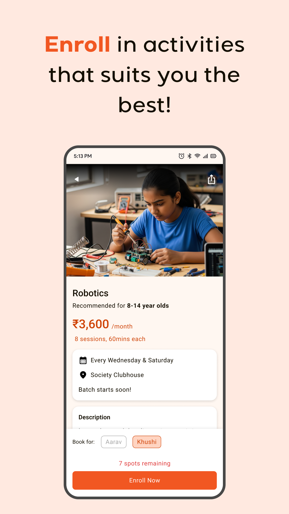
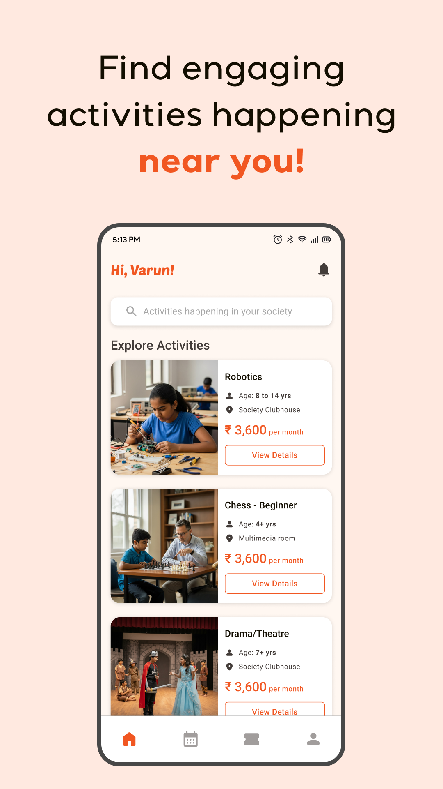
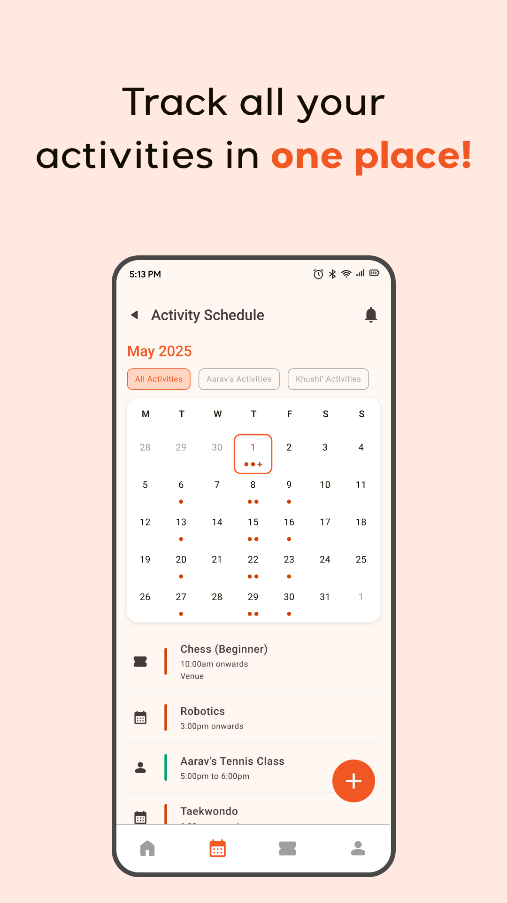
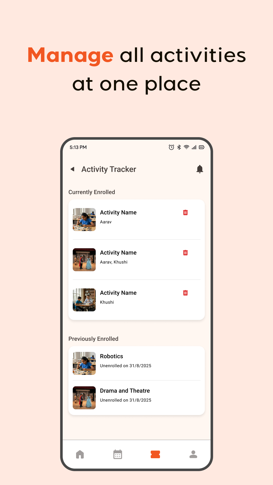
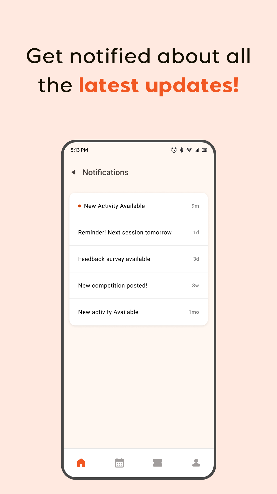

# 🌟 Klayons

**Klayons** is redefining after-school learning by bringing expert-led extracurricular programs directly into residential communities.  
We believe that every child deserves access to enriching learning opportunities — right where they live.

By collaborating with certified instructors and activity specialists, Klayons transforms societies into vibrant learning ecosystems that inspire **curiosity, creativity, and confidence**.

---

## 🚀 Features

- 📚 Expert-led extracurricular programs
- 🏡 Society-based learning model
- 🔐 Email & Phone login with OTP verification
- 👤 Guest mode (explore without login)
- 📍 Location-based activity discovery
- 💬 Easy parent-instructor communication

---

## 📱 App Screenshots

| Login Page                                                                  | Guest Mode                                                                    | Home Page |
|-----------------------------------------------------------------------------|-------------------------------------------------------------------------------|-------------|
|  |  |  |  |  |  

---

## 🧠 Tech Stack

- **Frontend:** Flutter (Dart)
- **Backend:** Firebase
- **Authentication:** Email / Phone OTP + Guest Mode
- **Hosting:** Google Play Store

---

## ⚙️ Installation

1. Clone the repository:
   ```bash
   git clone https://github.com/yourusername/klayons.git
